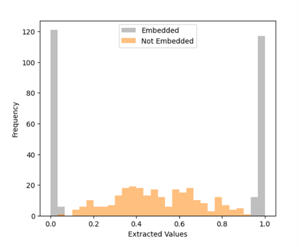

Embedding Watermarks into Deep Neural Networks
====
Implemented according to 'Embedding Watermarks into Deep Neural Networks' [1], 
the code embeds a digital watermark into a wide residual network during the training phase.
The embedding is achieved by applying a parameter regularizer to the target layer.

The code has been revised to accommodate TensorFlow version 2.12.0. 
For further reference, you can access the original project through the following link: https://github.com/yu4u/dnn-watermark


## Requirements

```sh
pip install tensorflow==2.12.0
pip install scikit-learn==1.2.2
pip install pandas==1.5.3
```

## Usage
Embed the watermark during the training phase of the host network:

```sh
python train_wrn.py config/train_random_min.json
```

Train the host network *without* embedding:

```sh
python train_wrn.py config/train_non_min.json 
```

Extracted watermarks from the embedded host network and the non-embedded network:



## License
All codes are provided for research purposes only and without any warranty.
When using any code in this project, we would appreciate it if you could refer to this project.


## References
[1] Y. Uchida, Y. Nagai, S. Sakazawa, and S. Satoh, "Embedding Watermarks into Deep Neural Networks," ICMR, 2017.
